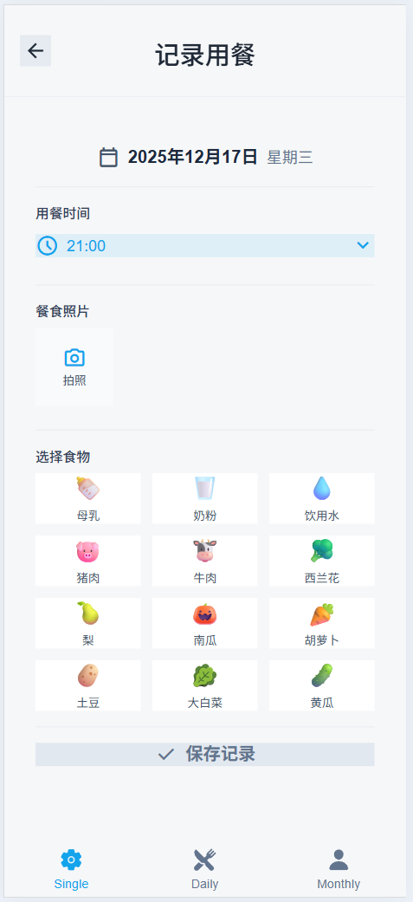
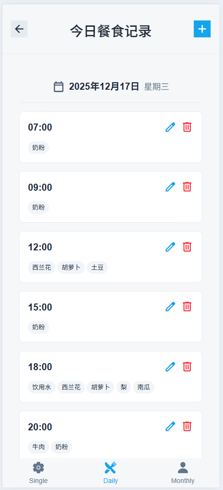
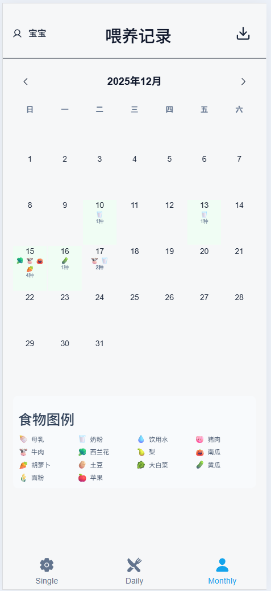

# Baby Meal Tracker 🍼

A clean, full-stack web app for parents to log and track their baby's daily meals. Built to be simple, fast, and reliable.

## 🚀 Live Demo
**👉 Use the App Here:** [Baby Meal Tracker](https://baby-meal-frontend.vercel.app)

## 🖼️ How It Works

| | |
| :--- | :--- |
|  | **1. Log a Meal**  Quickly add each meal with time, date, and food items. |
|  | **2. Review Your Day**  See all meals for any selected day in one clear list. |
|  | **3. See the Month**  Get a visual calendar overview of the entire month's feeding pattern. |

## 🛠️ Built With (Full-Stack)
- **Frontend:** `Ionic` / `Angular` (Deployed on **Vercel**)
- **Backend:** `Node.js` / `Express.js` (API on **Vercel**)
- **Database:** `PostgreSQL` (Managed by **Neon** - Serverless)
- **Tools:** `Git`, `GitHub`

## 💡 Why This Project?
This is a complete, production-ready application I built from scratch. It demonstrates my ability to:
- **Design and implement** a full-stack architecture.
- **Ship a real product** from frontend to database.
- **Solve a practical problem** with clean, maintainable code.

---
*Built as part of my #BuildInPublic journey. Feedback is welcome!*
